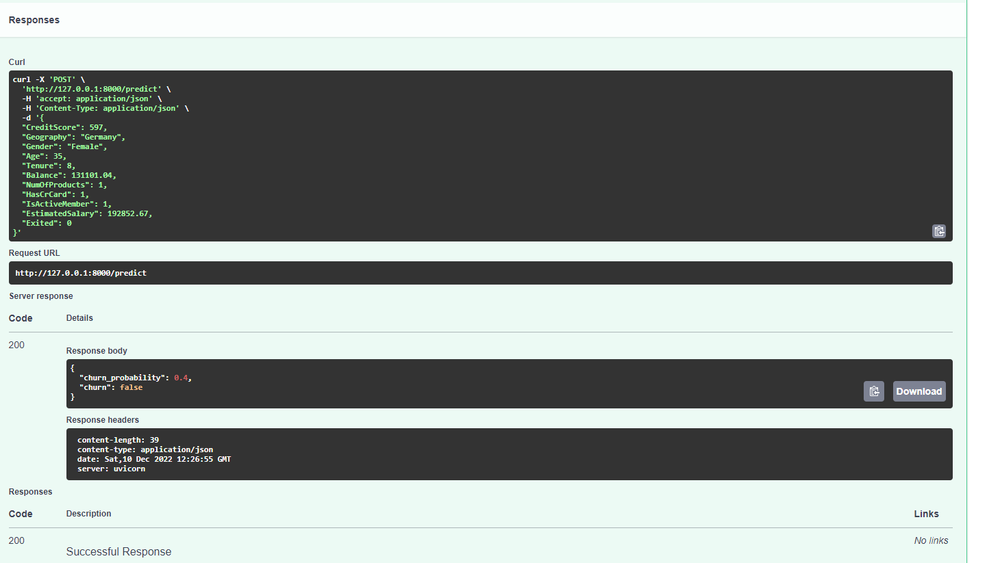
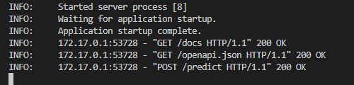

# FastAPI project
This project has been created to apply FastAPI to a ML project and it's part of a challenge called [Project-of-the-week](https://github.com/DataTalksClub/project-of-the-week/blob/main/2022-12-07-fastapi.md) that is being held by Datatalks.club.
# Content
## Enviroment
### I'll use a conda enviroment for this project
```sh
conda create -n fastapi python=3.9
conda activate fastapi
```
### Install fastapi
```sh
pip install fastapi
```
### Install other libraries that we'll use
```sh
pip install -r requirements.txt
```
### I'll use a previous model for this project. It has made on a previous project-of-the-week.
[churn-prediction-app](https://github.com/eeeds/churn-prediction-app)
# Tools
-   Python
-   Anaconda
-   Pandas
-   Scikit-Learn
-   FastAPI

# Learning FASTAPI
[Youtube Video](https://www.youtube.com/watch?v=0RS9W8MtZe4)
## First app
```python
from fastapi import FastAPI

app = FastAPI()


@app.get("/")
async def root():
    return {"message": "Hello World"}
```
## Run the app
```sh
uvicorn main:app --reload
```

The command uvicorn main:app refers to:

-   main: the file main.py (the Python "module").
-   app: the object created inside of main.py with the line app = FastAPI().
-   --reload: make the server restart after code changes. Only use for development.
## Access to documentation
You can access to your app documentation following [link](http://localhost:8000/docs)

## Prediction app
```python
from fastapi import FastAPI
import pickle 

model_file = './models/pipeline.bin'

with open(model_file, 'rb') as f_in:
    pipeline = pickle.load(f_in)


app = FastAPI()

@app.post('/predict')
async def predict(customer:dict):
    y_pred = pipeline.predict_proba(customer)[0,1]
    churn = y_pred>=0.5

    result = {
        'churn_probability': float(y_pred),
        'churn': bool(churn)
    }

    return result 

```
## Run the app
```sh
uvicorn predict:app --reload
```
## Test request in https://localhost:8000/docs using this customer:
```
{
  "CreditScore": 597,
  "Geography": "Germany",
  "Gender": "Female",
  "Age": 35,
  "Tenure": 8,
  "Balance": 131101.04,
  "NumOfProducts": 1,
  "HasCrCard": 1,
  "IsActiveMember": 1,
  "EstimatedSalary": 192852.67,
  "Exited": 0
}
```
## Result
```
{
  "churn_probability": 0.4,
  "churn": false
}
```


## Create a python script to test the API
```python
import requests

url = 'http://localhost:8000/predict'

customer = {
  "CreditScore": 597,
  "Geography": "Germany",
  "Gender": "Female",
  "Age": 35,
  "Tenure": 8,
  "Balance": 131101.04,
  "NumOfProducts": 1,
  "HasCrCard": 1,
  "IsActiveMember": 1,
  "EstimatedSalary": 192852.67,
  "Exited": 0
}

response = requests.post(url, json=customer).json()

print(response)

```
## Run the script
```sh
python test.py
```
# Error Handling

# Dockerfile
I've created the following Dockerfile in order to use it as a container:
```dockerfile
FROM python:3.9.15

WORKDIR /code

COPY ./requirements.txt /code/requirements.txt

RUN pip install --no-cache-dir --upgrade -r /code/requirements.txt

COPY ./predict.py /code/predict.py

COPY ./models/pipeline.bin /code/models/pipeline.bin

CMD ["uvicorn", "predict:app", "--reload", "--host", "0.0.0.0", "--port", "8000"]
```
## Build the image
```sh
docker build -t fastapi .
```
## Run the container
```sh
docker run -d -p 8000:8000 fastapi
```
## Testing docker container
